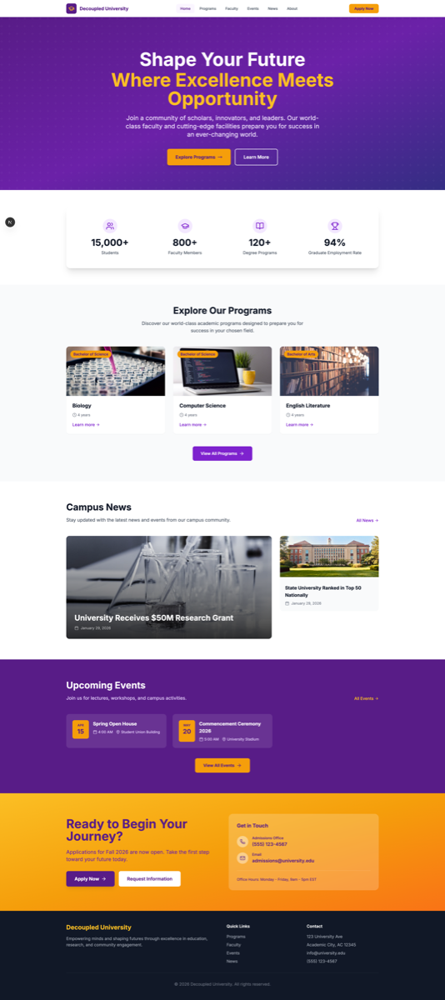

# Decoupled Synagogue

A synagogue and Jewish community website starter template for Decoupled Drupal + Next.js. Built for Reform, Conservative, and Orthodox congregations, Jewish community centers, and temples.



## Features

- **Programs** - Showcase religious school, Torah study, social action committees, and community initiatives with schedules and registration
- **Service Times** - Display Shabbat and holiday service schedules with times, styles, and descriptions
- **Events** - Promote holiday celebrations, community seders, scholar-in-residence weekends, and special gatherings
- **News** - Publish congregation news, rabbi messages, and community announcements with categories and authors
- **Modern Design** - Clean, accessible UI optimized for synagogue and Jewish community content

## Quick Start

### 1. Clone the template

```bash
npx degit nextagencyio/decoupled-synagogue my-synagogue
cd my-synagogue
npm install
```

### 2. Run interactive setup

```bash
npm run setup
```

This interactive script will:
- Authenticate with Decoupled.io (opens browser)
- Create a new Drupal space
- Wait for provisioning (~90 seconds)
- Configure your `.env.local` file
- Import sample content

### 3. Start development

```bash
npm run dev
```

Visit [http://localhost:3000](http://localhost:3000)

---

## Manual Setup

If you prefer to run each step manually:

<details>
<summary>Click to expand manual setup steps</summary>

### Authenticate with Decoupled.io

```bash
npx decoupled-cli@latest auth login
```

### Create a Drupal space

```bash
npx decoupled-cli@latest spaces create "My Synagogue"
```

Note the space ID returned. Wait ~90 seconds for provisioning.

### Configure environment

```bash
npx decoupled-cli@latest spaces env 1234 --write .env.local
```

### Import content

```bash
npm run setup-content
```

This imports:
- Homepage with hero, stats (450+ families, 150 students, founded 1954, 2,000+ volunteer hours), and membership CTA
- 3 service times: Erev Shabbat Service, Shabbat Morning Service, High Holy Days Services
- 3 programs: Religious School, Shabbat Morning Torah Study, Social Action & Tikkun Olam Committee
- 3 events: Purim Carnival, Community Passover Seder, Scholar-in-Residence Weekend
- 3 news articles: Spring B'nei Mitzvah, Cantor Benefit Concert, Rabbi's Message
- 2 static pages: About Temple Beth Shalom, Membership

</details>

## Content Types

### Program
- **program_type**: Type taxonomy (Education, Worship, Social Action, Youth, Adult Learning)
- **leader**: Program leader name
- **schedule**: When the program meets
- **location**: Where the program takes place
- **age_group**: Target age group
- **registration_url**: Link to register
- **image**: Program image

### Service Time
- **service_name**: Name of the service
- **day_of_week**: Day the service occurs
- **start_time / end_time**: Service time range
- **service_style**: Style of service (e.g., "Reform liturgy with contemporary music")
- **notes**: Additional notes about the service
- **image**: Service image

### Event
- **event_date / end_date**: Event date and time range
- **location**: Where the event takes place
- **event_category**: Category taxonomy (Holiday, Community, Lifecycle, Learning, Social)
- **speaker**: Speaker or event leader
- **registration_url**: Link to register
- **cost**: Event cost or pricing
- **image**: Event promotional image

### News
- **news_category**: Category taxonomy (Announcements, Lifecycle, Community, Clergy)
- **publish_date**: Publication date
- **author**: Article author
- **summary**: Brief article summary
- **image**: Featured image

### Homepage
- **hero_title**: Main headline (e.g., "Welcome Home")
- **hero_subtitle**: Secondary tagline
- **hero_description**: Welcome message
- **stats_items**: Key statistics (families, students, founded year, volunteer hours)
- **featured_items_title**: Section heading for featured content
- **cta_title / cta_description**: Membership call-to-action block

### Basic Page
- General-purpose static content pages (About, Membership, etc.)

## Customization

### Colors & Branding
Edit `tailwind.config.js` to customize colors, fonts, and spacing.

### Content Structure
Modify `data/synagogue-content.json` to add or change content types and sample content.

### Components
React components are in `app/components/`. Update them to match your design needs.

## Demo Mode

Demo mode allows you to showcase the application without connecting to a Drupal backend.

### Enable Demo Mode

```bash
NEXT_PUBLIC_DEMO_MODE=true
```

### Removing Demo Mode

1. Delete `lib/demo-mode.ts`
2. Delete `data/mock/` directory
3. Delete `app/components/DemoModeBanner.tsx`
4. Remove `DemoModeBanner` from `app/layout.tsx`
5. Remove demo mode checks from `app/api/graphql/route.ts`

## Deployment

### Vercel (Recommended)
[](https://vercel.com/new/clone?repository-url=https://github.com/nextagencyio/decoupled-synagogue)

### Other Platforms
Works with any Node.js hosting platform that supports Next.js.

## Documentation

- [Decoupled.io Docs](https://www.decoupled.io/docs)
- [Next.js Documentation](https://nextjs.org/docs)
- [Drupal GraphQL](https://www.decoupled.io/docs/graphql)

## License

MIT
